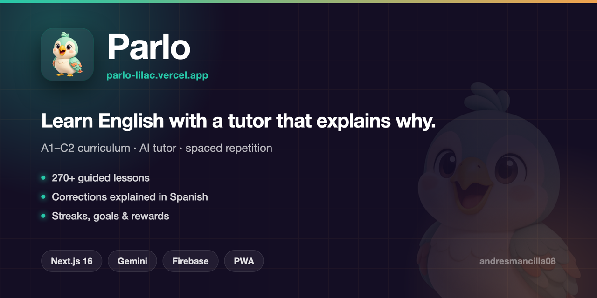

<p align="center">
  
</p>

# Parlo 🦜

**Learn English with a tutor that corrects you and explains *why* — in Spanish.**

A PWA for Spanish speakers that pairs a level-based curriculum with an AI tutor, spaced repetition, pronunciation practice and gamification. Every mistake gets an explanation in your own language, not a red X.

🌐 **[parlo-lilac.vercel.app](https://parlo-lilac.vercel.app)** · Installable PWA · In production

---

## Why it exists

Most learning apps tell you an answer is wrong. They rarely tell you *why* — and for a Spanish speaker the *why* is usually a specific interference: *do/does*, present perfect vs. past simple, false friends, word order. Parlo's tutor is built around those, and answers in Spanish so the explanation never becomes a second thing to decode.

## What it does

**Curriculum**
- Level-based path — **18 units / 54 lessons / 270 exercises** shipped across A1 · A2 · B1 (B2–C2 in progress)
- Exercise types: multiple choice, gap fill, translation, listening, word order, pronunciation
- Focus mode — one exercise at a time, no dashboard noise

**AI tutor**
- Corrects free-form answers and explains the rule in Spanish, targeting Spanish → English interference
- Server-side only: prompts and keys never reach the client, with per-session rate limiting

**Retention**
- SRS scheduler — items resurface right before you'd forget them
- Vocabulary bank built from your own mistakes

**Gamification**
- Daily goal, streaks, challenges, gems and rewards, level progression

**Platform**
- Installable PWA, partial offline, cross-device progress sync
- Responsive: single-column focus on mobile, two-column path on desktop
- Speech synthesis and recognition via the native Web Speech API — no paid voice service

## Stack

| Layer | Tech |
|---|---|
| Framework | Next.js 16 (App Router, TypeScript) · Tailwind CSS v4 |
| PWA | Serwist (`@serwist/next`) — installable + partial offline |
| Motion | Framer Motion |
| Auth & data | Firebase (Auth, Firestore) |
| AI | Vercel AI SDK + Google Gemini (`gemini-flash-latest`) |
| Voice | Web Speech API (native) |
| Icons | @tabler/icons-react |
| Hosting | Vercel (auto-deploy on `main`) |

## Architecture notes

- **The AI key never reaches the browser.** Tutor calls run server-side, with prompt hardening and per-session rate limiting (`lib/rate-limit.ts`).
- **Progress is local-first, then synced.** Lessons resolve against local state so a flaky network never blocks a session; `lib/sync.ts` reconciles with Firestore.
- **The build uses webpack on purpose** — Serwist's `InjectManifest` isn't compatible with Next 16's default Turbopack build yet.
- **Zero running cost by design**: Gemini free tier, Firebase Spark, Vercel Hobby.

## Running locally

```bash
pnpm install
cp .env.example .env.local   # Firebase config + Gemini key
pnpm dev                     # http://localhost:3000
```

| Command | What it does |
|---|---|
| `pnpm dev` | Dev server (Turbopack) |
| `pnpm build` | Production build (**webpack**, required by Serwist) |
| `pnpm start` | Serve the build |
| `pnpm lint` | ESLint |

Environment variables: `NEXT_PUBLIC_FIREBASE_*` (Firebase project config) and `GOOGLE_GENERATIVE_AI_API_KEY` (free key from [Google AI Studio](https://aistudio.google.com/apikey)).

## Structure

```
app/                  App Router routes, layout, sw.ts, manifest.ts
components/           UI + lesson players
lib/curriculum/       Content: levels/a1 · a2 · b1, types, speech
lib/srs.ts            Spaced repetition scheduler
lib/gamification.ts   Goals, streaks, challenges, rewards
lib/rate-limit.ts     Tutor rate limiting
lib/sync.ts           Local ↔ Firestore progress sync
locales/              i18n resources
docs/contexto/        Architecture, conventions, decisions, glossary
```

---

Docs: [roadmap](docs/roadmap-mvp.md) · [project context](docs/contexto/)
